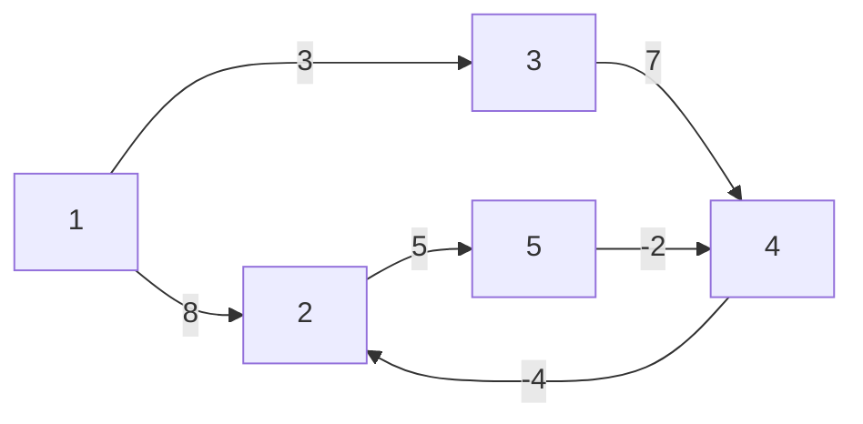

# 벨만 포드 알고리즘 이해하기
> 음수 간선을 탐지할 수 있는 최단거리 알고리즘. 시작점으로부터 각 노드까지의 거리를 모두 계산한다.

```python
# Bellman-Ford
import sys
input = sys.stdin.readline
INF = 1<<31   # 2**31

def bf(start: int) -> bool:
    dist[start] = 0
    for x in range(n-1):
        for i in range(m):
            current_node = edges[i][0]
            next_node = edges[i][1]
            cost = edges[i][2]

            # 현재 간선을 거쳐서 다른 노드로 이동하는 거리가 더 짧은 경우
            if dist[current_node] != INF and dist[next_node] > dist[current_node] + cost:
                dist[next_node] = dist[current_node] + cost

    for i in range(m):
		current_node = edges[i][0]
		next_node = edges[i][1]
		cost = edges[i][2]

        # n번째 라운드에서도 값이 갱신된다면 음수 순환이 존재
        if dist[current_node] != INF and dist[next_node] > dist[current_node] + cost:
            return True

    return False


n, m = map(int, input().split())
edges = []
dist = [INF] * (n+1)

for _ in range(m):
    a, b, c = map(int, input().split())
    edges.append((a, b, c))

negative_cycle_exists = bf(1)   # 1에서 시작

if negative_cycle_exists:
    print(-1)
else:
    for i in range(2, n+1):
        if dist[i] == INF:
	        print(-1)
	    else:
	        print(dist[i])

```

아직 벨만 포드 알고리즘을 이해하지 못했을 때, 왜 N번 반복해야되는지 몰랐었다. 그러던 중 [[벨만 포드 알고리즘 이해하기#^2f7747|유튜브 하루코딩 채널에서 강의]]를 듣고 이해하게 되었는데 여기에 정리한다.

1. N개의 노드를 가진 그래프에서 음수 사이클이 없을 때 특정 두 노드의 최단 거리를 구성할 수 있는 간선의 최대 개수는 N-1개
2. 그래서 모든 가능성을 탐색하기 위해 N-1번 반복하고 여기서 한 번 더 반복했을 때 거리 테이블이 갱신된다면(더 작은 거리가 나온다면) 음수 사이클이 존재한다고 볼 수 있다.
3. 업데이트 반복 횟수 `x`가 `k`번이면 해당 시점에 정답 리스트의 값은 시작점에서 `k`개의 간선을 사용했을 때 각 노드에 대한 최단거리

## 예시
### 그래프

### 간선 리스트
다음은 위의 그래프를 간선 리스트로 표시한 것이다(`edges = [(a, b, c), ... ]`)

| edge      | 1   | 2   | 3   | 4   | 5   | 6   |
| --------- | --- | --- | --- | --- | --- | --- |
| 출발 노드 | 1   | 2   | 1   | 3   | 4   | 5   |
| 종료 노드 | 2   | 5   | 3   | 4   | 2   | 4   |
| 가중치    | 8   | 5   | 3   | 7   | -4  | -2    |

위와 같은 예에서 거리 테이블이 어떻게 갱신되는지 보자
### 거리 테이블(정답 리스트)
#### 첫 번째 단계
시작점(1)을 0으로 갱신한다.

| 1   | 2   | 3   | 4   | 5   |
| --- | --- | --- | --- | --- |
| 0   | INF | INF | INF | INF |

첫 번째 반복(`x == 0`)은 간선 하나를 사용해 이동할 수 있는 최단거리이다. 1번에서 간선 하나를 사용해 갈 수 있는 노드는 2(8), 3(3)이다.

| 1   | 2   | 3   | 4   | 5   |
| --- | --- | --- | --- | --- |
| 0   | 8   | 3   | INF | INF |

#### 두 번째 단계
두 번째 반복에서는 간선 2개를 사용해 이동할 수 있는 최단거리. 1번에서 간선 2개를 사용해 갈 수 있는 노드는 4(11), 5(13)이다

| 1   | 2   | 3   | 4   | 5   |
| --- | --- | --- | --- | --- |
| 0   | 8   | 3   | 10  | 13  | 

#### 세 번째 단계
1 -> 3 -> 4 -> 2 로 가면 6의 비용이 들고, 8보다 작으므로 갱신

| 1   | 2   | 3   | 4   | 5   |
| --- | --- | --- | --- | --- |
| 0   | 6   | 3   | 10  | 13  | 


#### 네 번째 단계
1 -> 3 -> 4 -> 2 -> 5 로 가면 11의 비용이 들고, 13보다 작으므로 갱신

| 1   | 2   | 3   | 4   | 5   |
| --- | --- | --- | --- | --- |
| 0   | 6   | 3   | 10  | 11  | 

#### 다섯 번째 단계
1 -> 3 -> 4 -> 2 -> 5 -> 4 와 같이 간선 5개를 사용해 4로 갔을 때 10보다 작은 9의 비용이 든다. 여기서 더 반복하면 1 -> 3 -> 4 -> 2 -> 5 -> 4 -> 2 -> 5 -> 4 와 같이 무한히 순환하며 비용이 음의 무한대가 된다. 더이상 진행하며 정답 리스트를 초기화하는 것이 의미가 없으므로 종료.

| 1   | 2   | 3   | 4   | 5   |
| --- | --- | --- | --- | --- |
| 0   | 6   | 3   | 9  | 11  | 

# 참고자료
- https://youtu.be/061eXyAFRuI ^2f7747