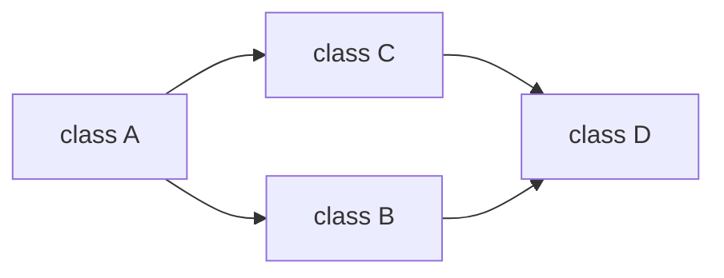
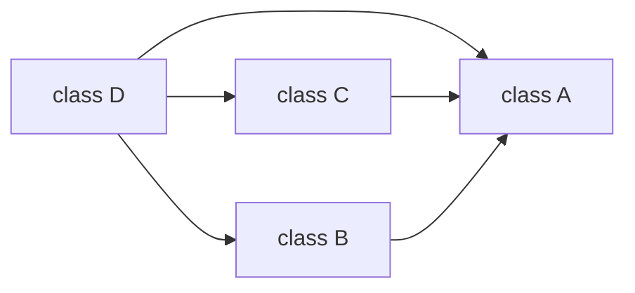

# Method Resolution Order

클래스 상속시 우선순위가 부여된다. class A가 B와 C를 상속하면(`class A(B, C):`), A에게 B가 C보다 더 높은 우선순위가 있다. 이 우선순위를 Method Resolution Order라고 칭한다. 이를 통해 자기 자신과 부모 클래스에 같은 이름을 가진 메서드가 있다면 어떤 메서드를 실행할지 결정한다. 

`__mro__` 메서드를 통해 확인할 수 있고, 앞쪽에 나오는 값이 더 높은 우선순위를 가진다.

```python
class D:
	def a(self):
		print('d')


class B(D):
	def a(self):
		print('b')


class C(D):
	def a(self):
		print('c')


class A(B, C):
	def a(self):
		print('a')

```
위와 같은 경우를 보자.

```python
>>> one = A()
>>> one.a()
a
```
자기 자신에게 a라는 메서드가 있으므로 'a'가 출력된다.

```Python
class D:
	def a(self):
		print('d')


class B(D):
	def a(self):
		print('b')


class C(D):
	def a(self):
		print('c')


class A(B, C):
	pass
```
이 경우는 어떻게 될까?

```python
>>> one = A()
>>> one.a()
b
```

A가 B를 C보다 먼저 상속하기때문에 B의 메서드가 더 높은 우선순위를 가진다.

```python
class D:
	def a(self):
		print('d')


class B(D):
	def a(self):
		super().a()


class C(D):
	def a(self):
		print('c')


class A(B, C):
	pass

```
그런데 A에게 더 높은 우선순위를 갖는 B 클래스의 a 메서드가 상위 클래스의 a 메서드를 호출할 때 아래와 같은 경우 어떻게 될까?
```python
>>> one = A()
>>> one.a()
c
```
A에게 D보다 C가 우선하므로 C의 메서드가 호출됐다.


```python
class A:
  def method(self):
    print("A.method() called")

class B:
  def method(self):
    print("B.method() called")

class C(A, B):
  pass

class D(C, B):
  pass

d = D()
d.method()
```
D에 메서드가 없어 C를 먼저 찾는데, C에도 없어 A를 찾고 그 다음 C의 2번째 우선순위인 B를 찾는다.


## `TypeError: Cannot create a consistent method resolution order (MRO)`
> MRO를 정상적으로 생성할 수 없을 때 발생하는 오류

```python
class A:
    pass


class B(A):
    pass


class C(A):
    pass


class D(A, B, C): # 에러 발생!
    pass
```
D에게 A가 가장 높은 우선순위를 갖는데 B와 C가 A를 상속받고 있어 순서가 꼬인다.


```python
class A:
    pass


class B:
    pass


class C(A, B):
    pass


class D(B, A):
    pass


class E(C, D): # 에러 발생!
    pass
```
E의 우선순위는 C -> D 인데, C의 우선순위는 A -> B 이고 D의 우선순위는 B -> A이다. 


---
# 참고자료
- https://tibetsandfox.tistory.com/26
- https://www.educative.io/answers/what-is-mro-in-python